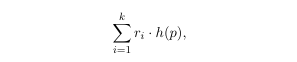
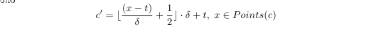

# kNN-and-Clustering-on-Time-Series-and-Curves
LSH/Hypercube kNN and KMeans++ Clustering on polygonic curves and time series

In this project we will explore the knn method using LSH/Hypercube 

## Instalation
To download the project just `git clone` the repository.

To compile and execute the program using different algorithms:

```bash
~$ make search [verbose=1] [debug=1] # make the search executable
~$ ./search -i <input filename> -q <query filename> -o <output filename> -algorithm [LSH | Hypercube | Frechet] [-metric [discrete | continuous] default is discrete] [-k -L -M -N -probes -delta]
# In order to print the accuracy of each of the above algorithms in the output file you have to type the above commands like this: make search verbose=1
~$ make clustering [verbose=1] [debug=1] # make the clustering test case
~$ ./cluster -i <input filename> -o <output filename> -c <cluster config filename> -update [Mean_Vector | Mean_Curve] -assignment [Classic | LSH | Hypercube | LSH_Frechet] [-silhouette] [-complete] 
~$ make tests [verbose=1] [debug=1] # create test cases
~$ ./run_tests # run the unit tests
~$ make clean # delete objective files
```

## kNN on Curves
### LSH Algorithm
The LSH algorithm, based on the k-hash functions with formula:
=%20\frac{\boldsymbol{p}%20\cdot%20\boldsymbol{v_i}%20%2B%20t_i}{w}$)

was implemented  from the classes **Hashing** και **LSHHasing**. The Hashing class produces and saves the **v_i** and **t_i** as well as the production of the  **h_i** values. 

Τhe **LSHHashing**, calculates the functions . Its also responsible for the estimation of the value: 
 where the r_i are separate for each amplified function g. 
 

The class that implements the LSH Nearest Neighbours, (**LSHNearestNeighbours**),initializes L functions and  Hashtables and contains helper functions  for the import of a point in the hashtable, for nearest neighbor search , k-nearest-neighbors search and range-nearest-neighbors search according to a query point.

### Hypercube Algorithm
Random display in Hypercube is a similar algorithmic technique to LSH. However, instead of L hashtables with their own Amplified HashFunction, our data set is stored at the top of a Hypercube.Initially for the implementation needs of Hypercube we created the HyperCubeHashing class. This class, as in LSH, is derived from Hashing and every time the input element is shifted and then the formula "h" is calculated in it. 
Then the f functions, all they need to do is map the result of h to {0,1} (depending on whether it already exists in f or not). Finally, a dd dimension hypercube is created at the same time as the d 'HashFunctions and f functions. Each time an item is entered, it is first mapped by each HyperCubeHash function and then mapped to {0.1} by f. The result is a binary number of length dd (which is equivalent to a decimal number, specifically with the index of the vertex to which the element will be inserted). \\
Next we compute a set of vertices with distance $hamming <hd$ and loop over the points that were hashed on the same vertex or on a vertex with a certain hamming distance. (To find the nearby vertices each time we use the retrospective function **nearVertices**, with an optimization as it uses a visited set and has essentially similar functionality to dfs)


### LSH/Hypercube with Discrete Frechet
The curve hashing algorithm gets as input a curve and returns its grid curve. In order to do that we iterate through each Point of the curve, find its hash according to this formula: **floor((point.getCoordinate(i) - t[i])/delta + 0.5) * delta + t[i]**
At the same time, we check so that the grid curve wont have any duplicate points and at the end we concatenate all the hashed points together.After creating the grid curve, we squeeze it (concatenate all the points of the grid curve to one point), we add (if necessary) padding so that we always have the same dimension at our points. At this point we are ready to use the LSH(or Hypercube) algorithm to find the k-Nearest Neighbors

### LSH/Hypercube with Continuous Frechet
To implement LSH/Hypercube with Continuous Frechet, we used a subclass of the base Class **HashingCurve**, **CLHHashingCurve**. 

According to the theory we implemented the algorithm for continuous curve hashing as follows: For each curve c \ in Dataset$:
- filter with **CLSHHashing :: filter** to display the curve at $R$,
- we use the same function for grid snapping as in discrete curve hashing, to map the points of the filtered curve c at the points of the grid 
according to the formula 
- in the grid curve we keep only the local maximums and minimums
- we make the concatenated curve vector, x
- we apply padding based on the highest value of all grids

This class also contains the filtering method, which based on an error, filters the given curve. For further use of this method, read the section **Clustering :: Mean Curve Update**

## Clustering

### Lloyd Algorithm 
In the Lloyd function, only the assignment step of the algorithm has been implemented since the update part is done by another function in K-Means, based on our implementation.
The implementation of Lloyd's algorithm is a faithful application of slides. Specifically what we do is to:
- Parse all points of our dataset
- For each point we find its closest centroid
- If we are in the 1st step of Lloyd then we just add the point to the unordered map of each cluster
- Otherwise, we compare the cluster_id of the point (which it already has), with the closest \ _centroid id we found in this loop.
- If it is the same, then we just update the distance of the point from the centroid of the cluster in which it was already.
 - Otherwise, assign the point to the new cluster, delete the point from the unordered map of the old cluster and increase the points changed
### Reverse Assignment
The reverse assignment algorithm is implemented according to the slides and using internal static variables to initialize the search radius once and at the end of its call to double it. To avoid divergence, we set a search based on the search radius (see R max in the ClusterSolver.hpp file) so that after a maximum search radius, the elements remaining in the unassigned table are assigned in a brute force manner. To observe the convergences of the algorithms we can play with these hyperparameters of convergence and observe the assignments that will throw us in stdout when we compile with **verbose = 1** in make.
The 2 algorithms that implement the range search (LSH and Hypercube) are given through separate interface functions (see AssignmentStep.cpp) so that we pass the Nearest neighbors solvers (which are defined as static objects for unique initialization) in the general interface of the reverse assignment. In this way we will need to pass 1 specific type of assignment function to the constructor of the cluster solver without having to know its implementation. 
During the assignment we set the cluster id at the corresponding point so as to facilitate the execution of the silhouette.
### Mean Curve Update
The update step in KMeans, accesses all the centroids and the curves assigned to them. The curves of each centroid are stored in a vector of curves (Curvetree), which is given as a parameter in the finding function of the Mean Curve. After calculating the Mean Curve, it is assigned as the new centroid.
The function for finding the Mean Curve has been implemented in 3 hierarchical stages. The initial function takes as an argument a vector from Curves, where it aims to find the total mean curve. But instead of implementing it with a binary complete tree, we transferred the same logic to a table implementation. That is, the table is filled as if we did a level order traversal in b-tree. Inside the basic algorithm you will see that in the central loop we proceed by 2 * step and each time we check this sheet with the sheet in the i + step position.
We pass the curves in these positions as an argument to the next one in the getMeanCurve hierarchy and save the mean curve in position i while deleting the curve in position i + step. To maintain the dimensionality, we use filtering techniques similar to those we use in Continuous Curve LSH , based on an error tolerance that increases until a sustainable mean curve size is achieved.
The next function in the getMeanCurve hierarchy simply calls the optimal path finding function (which we added to Fred's Frechet class) and calculates through the optimal path the mean curve between 2 any curves.
The last in the getMeanCurve hierarchy calculates using L2_Norm the distance between the points of each tuple of the optimal path.


## Collaborators
- Aristi Papastavrou, Github profile: https://github.com/AristiPap
- Vissarion Moutafis, Github profile: https://github.com/VissaMoutafis/

